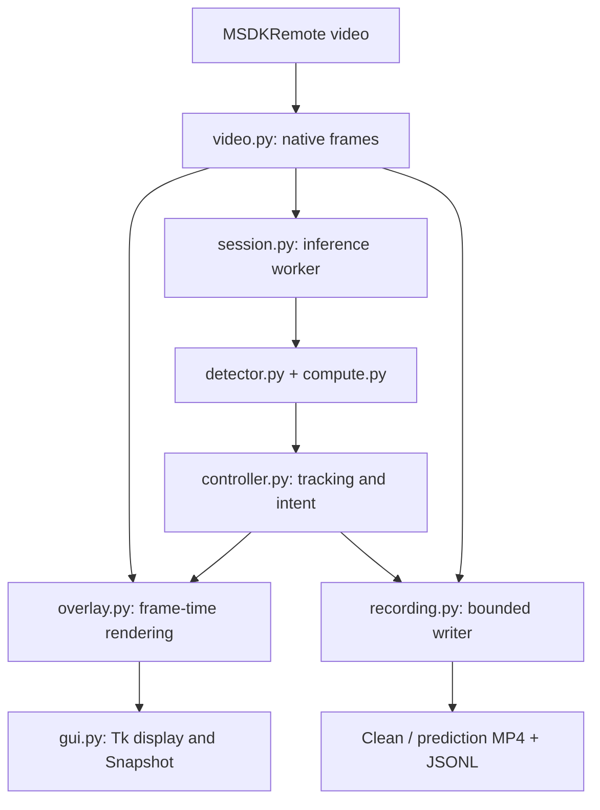

# Architecture — v0.2.0

All new application code lives under `tools/atlas2_follow_neo`. ATLAS Web/HTTP server is not required; Yam's Android Java application remains unchanged. Video uses TCP 9999. Manual keyboard and explicitly enabled NEO Dance share one TCP 9998 connection and one command writer.

| File | Responsibility |
|---|---|
| compute.py | OS-specific GPU provider, DXGI adapter selection, warmup, EP profiling, explicit fallback |
| detector.py | Unchanged model bytes, 640-square model tensor preparation, NMS, native pixel coordinates |
| video.py | Raw H264/H265 receive/decode; immutable native-resolution Frame objects |
| session.py | Separate capture/inference/60Hz preview workers, recording handoff, settings generations |
| tracker.py | Eight-state Kalman, resolution-scaled pixel noise/gates/speeds, latency compensation |
| controller.py | Tracking orchestration, 250–300ms measurement fade, 300ms overlay validity |
| policy.py | C++ centering and recovery policy ports |
| spacing.py | C++ visual spacing state machine port; STOPPED remains latched until reset |
| overlay.py | Exact analyzed-frame boxes or time-aligned live estimate; immutable Snapshot metadata |
| recording.py | Paired full-resolution H264 MP4, variable presentation timestamps, bounded queue |
| gui.py | Generic Auto/GPU/CPU selection, capture dropdown, pending-settings and recording status |
| manual.py | Keyboard axes, explicit control enable, serialized command/reply worker, UI heartbeat and release on shutdown |
| dance.py | Authorizes fresh, confirmed TRACK intent after explicit Dance activation; zeros lost, stale or stopped tracking |
| setup_env.py | Private venv and OS-specific runtime distribution; never changes system drivers |

GPU selection is an adapter boundary. Windows uses DmlExecutionProvider; macOS uses CoreMLExecutionProvider with MLProgram and CPUAndGPU. CPU is available on both. CoreML graph placement does not prove exclusive physical GPU execution. CUDA is not an option or dependency.

Frame dimensions are preserved. A 1920x1080 source is never replaced with a 640x480 tracking image. Kalman parameters are scaled by each axis relative to the C++ parameter units; only detector preprocessing creates a separate 640x640 tensor because this ONNX model has a fixed input shape.

An analyzed render stores its frame, detections, selected detection and the controller decision produced while consuming that result. A live render stores its display frame and the separate measurement ID/time. Prediction projection is evaluated at that frame's decode timestamp. Future measurements are never painted onto an older live frame. Failed association may legitimately retain an older measurement ID in the analysis decision, and that age is explicit.

Recording does not depend on the Tk refresh loop. Capture submits an immutable frame reference and latest decision to an eight-item queue. Clean and annotated outputs use the same frame and 90kHz PTS; overload drops the same input for both and is reported. The clean input is never mutated by overlays. Changing input resolution ends the recording with an explicit error, preserving the prior segment.

FollowController remains a pure computation. ManualControl selects keyboard axes or a dance.py-authorized decision, never both. Dance activation resets tracking and rejects decisions older than activation. The UI clears input and requests release on focus loss; movement keys switch to manual control. Commands use four decimal places. Network failures terminate the worker; remote release cannot be guaranteed after a broken connection. The serialized worker reports server-acknowledged flight_command events to the active session log. Tracking decision logs describe calculation, while flight_command events describe acknowledged transport. GUI disconnect waits for the writer to finish before closing session logs. No automatic takeoff is performed.
